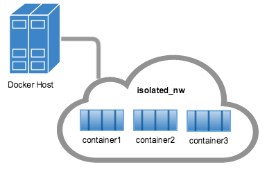

```{r, echo=FALSE}
knitr::opts_chunk$set(
  fig.align = "center",
  eval = FALSE
)
```

# Build, Ship and Run Shiny Data Science, Anywhere!

```{r, echo=FALSE, eval=TRUE, out.width="40%"}

```

# Docker?

```{r, echo=FALSE, eval=TRUE, out.width="70%"}
knitr::include_graphics("pix/containers.png")
```

## Containers versus Virtual Machines

```{r, echo=FALSE, eval=TRUE, out.width="40%", out.extra='style="float: left;"'}
knitr::include_graphics("pix/docker-vs-vm_vm.png")
knitr::include_graphics("pix/docker-vs-vm_docker.png")
```

<div style="clear: both;"></div>


## Containers together with Virtual Machines

```{r, echo=FALSE, eval=TRUE, out.width="70%"}
knitr::include_graphics("pix/containers-vms-together.png")
```

## Installation

Ubuntu

```{bash}
$ apt-get install docker.io
```

MAC, Windows, other Linuxes, ...

- https://www.docker.com/community-edition

# Images

An __image__ is a set of layers as defined in the `Dockerfile`.

_"An __image__ is a lightweight, stand-alone, executable package that includes everything needed to run a piece of software,
including the code, a runtime, libraries, environment variables, and config files."_

```{bash, eval=FALSE}
# Search for an image
$ docker search rocker

# Pull an image from the hub
$ docker pull rocker/shiny

# List local images
$ docker images
```

## Docker Hub

https://hub.docker.com

### Programming langues

- r-base
- python
- nodejs
- golang
- julia
- ...

### Databases

- mongodb
- postgresql
- mysql
- neo4j
- ...

### Webservers

- nginx
- httpd
- tomcat
- ...

### OSs

- ubuntu
- alpine
- centos
- ...

### ...

- hello-world
- ...

```{r, echo=FALSE, eval=TRUE}
#knitr::include_graphics("pix/docker-hub.png")
```

## Rocker Hub on Docker Hub

```{r, echo=FALSE, eval=TRUE,  out.width="20%"}

```

- https://hub.docker.com/r/rocker/
- https://github.com/rocker-org/rocker

Images

- rocker/r-base
- rocker/shiny
- rocker/tidyverse
- rocker/rstudio
- rocker/geospatial
- rocker/r-ver
- ...

# Containers

A __container__ is an instance of an __image__.

_"A __container__ is a runtime instance of an __image__ - what the __image__ becomes in memory when actually executed.
It runs completely isolated from the host environment by default, only accessing host files and ports if configured to do so."_

```{bash, eval=FALSE}
# Start a container
$ docker run -p 3838:3838 -d rocker/shiny

# -p ~ publish port to the world
# -d ~ run in detached mode

# List running container
$ docker ps

# List stopped container as well
$ docker ps -a
```

# Docker hierarchy

- Container:
    - define it with a `Dockerfile`
- Service:
    - combine, scale and balance containers: `docker-compose.yml` 
- Swarm:
    - dockerized cluster with a manager and workers: `docker swarm`, `kubernetes`, `rancher`, ...
- Stack:
    - handle services 

# Dockerfile

```{bash, eval=FALSE}
FROM rocker/r-base
LABEL maintainer="stefan kuethe <crazycapivara@gmail.com>"
RUN install2.r rmarkdown formatR bookdown
ADD ./book /book
WORKDIR /book
RUN apt-get update && apt-get install pandoc -y \
        && rm -rf /var/lib/apt/lists/*

CMD ["r", "render_book.R"]
```

## Build and run

```{bash}
$ docker build -t "stkuethe/rbook:v0.1" .

$ docker run -it --rm stkuethe/rbook:v0.1
```

## Containerit

Create a `Dockerfile` with the R package `containerit`

```{r, eval=FALSE}
devtools::install_github("r-hub/sysreqs")
devtools::install_github("o2r-project/containerit")

library(containerit)

dockerfile(from = sessionInfo()) %>%
  write("Dockerfile")
```

## Containerit output

```{bash, eval=FALSE}
FROM rocker/r-ver:3.4.1
LABEL maintainer="stkuethe"
RUN export DEBIAN_FRONTEND=noninteractive; apt-get -y update \
 && apt-get install -y git-core \
	pandoc \
	pandoc-citeproc
RUN ["install2.r", "-r 'https://cloud.r-project.org'", "Rcpp", ... "jsonlite"]
WORKDIR /payload/
CMD ["R"]

```

# Docker CLI

```{bash, eval=FALSE}

# Search a registry for images, defaults to the docker hub
$ docker search

# Pull an image from a registry
$ docker pull

# Push an image to a registry
$ docker push

# List local images
$ docker images

# Remove local image
$ docker rmi

# Build an image from a Dockerfile
$ docker build

# Run a new container
$ docker run

# Stop running container
$ docker stop

# Start a stopped container
$ docker start

# Restart a running container
$ docker restart

# Remove stopped container
$ docker rm

# List containers
$ docker ps

# Fetch the logs of a container
$ docker logs

# Run a command in a running container
$ docker exec

# Copy files/folders between a container and the local filesystem
$ docker cp

# Return low-level information on Docker objects
$ docker inspect 
```

# Pipelines

Combine different programming languages ...

```{bash}
#!/bin/sh
docker run --rm -it -v `pwd`/scripts:/scripts julia julia /scripts/random.jl
docker run --rm -it -v `pwd`/scripts:/scripts rocker/r-base r /scripts/multiply.R
docker run --rm -it -v `pwd`/scripts:/scripts continuumio/miniconda3 python /scripts/print_that.py
```

## Julia script

```{bash}
# random.jl
m = rand(1:10, 10, 10)
println(m)
writecsv("/scripts/random.csv", m)
```

## R script

```{r}
# multiply.R
df <- read.csv("/scripts/random.csv", header = FALSE)
df <- df * 0.3 + 2
print(df)
write.csv(df, "/scripts/random_update.csv")
```

## Python script

```{python}
# print_that.py
import csv

with open("/scripts/random_update.csv") as f:
  reader = csv.reader(f)
  for row in reader:
    print(row)
```

# Networks

```{r, echo=FALSE, eval=TRUE}

```

```
$ docker network create futurama
$ docker run -d --network futurama --name postgres postgres:9.5.6-alpine
$ docker network inspect futurama | jq ".[].Containers"
```

```{r, echo=FALSE, eval=TRUE}
knitr::include_graphics("pix/network_access.png")
```

```
$ docker network create futurama
$ docker run -d --network futurama -p 8787:8787 futurama rocker/rstudio

$ docker run -it --rm --network futurama alpine ping -c 2 postgres 
```

# Docker Compose

_Compose is a tool for defining and running multi-container Docker applications._

## Config file

```{bash, eval=FALSE}
# docker-compose.yml

version: "2"

services:
  minicran:
    image: crazycapivara/minicran
    volumes:
      - ./scripts:/scripts
      - ./repo:/miniCRAN
    command: r /scripts/create_repo.R
  nginx:
    image: nginx:alpine
    ports:
      - "8080:80"
    volumes:
      - ./repo:/usr/share/nginx/html
```

## Minicran script

```{r, eval=FALSE}
# create_repo.R

library(miniCRAN)

pkgs <- c("magrittr", "dplyr")
pkgList <- pkgDep(pkgs, suggests = FALSE)
CRAN_mirror <- "https://mran.microsoft.com/snapshot/2017-08-01"
makeRepo(pkgList, path = "/miniCRAN", repos = CRAN_mirror, type=c("source", "win.binary"))
```

## Start and stop services

```{bash}
# start services
$ docker-compose up -d

# stop services
$ docker-compose down
```

# Scale and balance that

## Load Balancer ~ haproxy

```{bash, eval=FALSE}
# docker-compose.yml

version: "2"
services:
  shiny:
    image: rocker/shiny
  lb:
    image: dockercloud/haproxy
    ports:
      - "5080:80"
      - "1936:1936"
    links:
      - shiny
    volumes:
      - /var/run/docker.sock:/var/run/docker.sock
```

## Run and scale

```{bash}
docker-compose up -d \
  && docker-compose scale shiny=3
```

# Some more use cases/examples

- neo4j
- h2oai
- tensorflow
- REST API using plumber
- CRAN stats with mongodb and metabase
- bookdown

## neo4j

### Dockerfile

```{bash}
FROM rocker/rstudio
LABEL maintaner="stkuethe <crazycapivara@gmail.com>"
RUN install2.r RNeo4j
ADD ./scripts /scripts
WORKDIR /scripts
```

### Script
```{r}
# rstudio_pkgs.R
library(RNeo4j)

## --- some helpers
add_relation <- function(x, y, relation) {
  from_node <- getOrCreateNode(graph, "rpackage", name = x)
  to_node <- getOrCreateNode(graph, "rpackage", name = y)
  createRel(from_node, relation, to_node)
}

add_pkg_deps <- function(pkg, deps, relation) {
  for (dep in deps) {
    add_relation(pkg, dep, relation)
    cat(sprintf("Added (%s) -[:%s]-> (%s)\n", pkg, relation, dep))
  }
}

## --- config
rstudio_pkgs <- c("magrittr", "tidyverse", "shiny", "rmarkdown",
             "ggplot2", "knitr", "tidyr", "readr", "readxl", "dplyr", "stringr")
relations <- c("Imports", "Suggests")
deps <- lapply(relations, function(relation) {
  tools::package_dependencies(rstudio_pkgs, which = relation)
})

## --- setup graph
graph <- RNeo4j::startGraph("neo4j:7474/db/data", "neo4j", "bender")
clear(graph, FALSE)
addConstraint(graph, "rpackage", "name")
cat("graph initialized\n")

## --- main loop
for (i in 1:length(relations)) {
  for (pkg in rstudio_pkgs) {
    add_pkg_deps(pkg, deps[[i]][[pkg]], toupper(relations[i]))
  }
}
cat("done\n")			

## ------------------------

cat("Test db\n")
argv <- commandArgs(TRUE)

dep <- ifelse(!is.na(argv[1]), argv[1], "jsonlite")
query <- sprintf('MATCH (n) -[:IMPORTS]-> (dep {name: "%s"}) RETURN n.name AS pkg, "imports" AS relation, dep.name AS dep', dep)
res <- cypher(graph, query)
print(res)

pkg <- ifelse(!is.na(argv[2]), argv[2], "readxl")
query <- sprintf('MATCH (pkg {name: "%s"}) -[r]-> (n) RETURN pkg.name AS pkg, type(r) AS rel, n.name AS dep', pkg)
res <- cypher(graph, query)
print(res)
```

### Docker-compose

```{bash}
version: "2"

services:
  neo4j:
    image: neo4j
    environment:
      - NEO4J_AUTH=neo4j/bender
    ports:
      - "7474:7474"
      - "7687:7687"
  terminal:
    build: .
    volumes:
      - ./scripts:/scripts
    depends_on:
      - neo4j
    command: ["./wait-for-it.sh", "neo4j:7474", "--", "Rscript", "rstudio_pkgs.R", "Rcpp", "dplyr"]
```

## h2oai

```{bash}
$ wget https://raw.githubusercontent.com/h2oai/h2o-3/master/Dockerfile

# Dockerfile.rstudio
FROM rocker/rstudio
LABEL maintainer="<crazycapivara@gmail.com>"
RUN install2.r h2o
ADD ./scripts /home/rstudio/scripts
RUN chown -R rstudio:rstudio /home/rstudio/scripts

# docker-compose.yml
version: "2"

services:
  h2oai:
    build: .
    command:  java -Xmx4g -jar /opt/h2o.jar
    ports:
      - "54321:54321"
  rstudio:
    build:
      context: .
      dockerfile: Dockerfile.rstudio
    ports:
      - "9797:8787" 

$ docker-compose up -d
```

## tensorflow

...

## Plumber

...

## CRAN stats

...

## bookdown 

...

# Continious Integration

```{r, echo=FALSE, eval=TRUE}
#
knitr::include_graphics("pix/gitlab-pipelines2.png")
```

## Gitlab CI

https://about.gitlab.com/

All in one

### Gitlab Container

```{bash}
# Gitlab
version: "2"

services:
  gitlab:
    image: "gitlab/gitlab-ce:latest"
    restart: always
    hostname: "172.17.0.1"
    environment:
      GITLAB_OMNIBUS_CONFIG: |
        external_url "http://172.17.0.1:9090"
        gitlab_rails["gitlab_shell_ssh_port"] = 2224
    ports:
      - "9090:9090"
      - "2224:22"
    volumes:
      - "./config:/etc/gitlab"
      - "./logs:/var/log/gitlab"
      - "./data:/var/opt/gitlab"
```

### Gitlab runner

#### Start runner

```{bash}
#!/bin/sh
docker run -d --name gitlab-runner \
  -v /var/run/docker.sock:/var/run/docker.sock \
  -v `pwd`/gitlab-runner/config:/etc/gitlab-runner \
  gitlab/gitlab-runner:latest
```

#### Register runner

```{bash}
$ docker exec -it gitlab-runner gitlab-runner register
```

#### Config

```{bash}
# config.toml

[[runners]]
  name = "bender"
  url = "http://"172.17.0.1:9090/"
  token = "3bd3d65fd0fe66bcece672a2eb7603"
  executor = "docker"
  [runners.docker]
    tls_verify = false
    image = "rocker/r-base"
    privileged = false
    disable_cache = false
    volumes = ["/www/data_science:/share_that", "/cache"]
    shm_size = 0
    pull_policy = "never"
  [runners.cache]
```

### Pipeline

```{bash}
# .gitlab-ci.yml

stages:
  - julia
  - r
  - deploy

julia:
  stage: julia
  image: julia
  artifacts:
    paths:
      - that.csv
    expire_in: 5 minutes
  script:
    - julia create_csv.jl

r:
  stage: r
  image: rocker/r-base
  script:
    - Rscript -e "df <- read.csv('that.csv'); do_science(df)"

deploy:
  stage: deploy
  image: alpine
  script:
    - cp that.csv /www/public
```

## Drone meets Gogs

https://drone.io/

Lighweight

```{r, echo=FALSE, eval=TRUE, out.width="20%"}
knitr::include_graphics("pix/droneio.png")
knitr::include_graphics("pix/gogs.png")
```

Other Integrations:

- GitLab
- Github
- Bitbucket
- Gitea


### Gogs container

```{bash, eval=FALSE}
# start gogs
$ docker run --name=gogs -p 10022:22 -p 10080:3000 -v /var/gogs:/data gogs/gogs
```

### Drone server and agent

```{bash}
version: '2'
services:
  drone-server:
    image: drone/drone:0.7
    ports:
      - 80:8000
    volumes:
      - /var/lib/drone:/var/lib/drone/
    restart: always
    environment:
      - DRONE_OPEN=true
      - DRONE_HOST=${DRONE_HOST}
      #- DRONE_GITHUB=true
      #- DRONE_GITHUB_CLIENT=${DRONE_GITHUB_CLIENT}
      #- DRONE_GITHUB_SECRET=${DRONE_GITHUB_SECRET}
      - DRONE_GOGS=true
      - DRONE_GOGS_URL=http://gogs.mycompany.com

  drone-agent:
    image: drone/drone:0.7
    command: agent
    restart: always
    depends_on:
      - drone-server
    volumes:
      - /var/run/docker.sock:/var/run/docker.sock
    environment:
      - DRONE_SERVER=ws://drone-server:8000/ws/broker
      - DRONE_SECRET=${DRONE_SECRET}
```

### Pipeline

```{bash}
# .drone.yml

pipeline:
  build:
    image: rocker/r-base
      commands:
      - cd /scripts/
      - Rscript run_tests.R
```

## Concourse

http://www.concourse.ci/

```{bash}
Version: '3'

services:
  concourse-db:
    image: postgres:9.5
    environment:
      POSTGRES_DB: concourse
      POSTGRES_USER: concourse
      POSTGRES_PASSWORD: changeme
      PGDATA: /database

  concourse-web:
    image: concourse/concourse
    links: [concourse-db]
    command: web
    depends_on: [concourse-db]
    ports: ["8080:8080"]
    volumes: ["./keys/web:/concourse-keys"]
    restart: unless-stopped # required so that it retries until conocurse-db comes up
    environment:
      CONCOURSE_BASIC_AUTH_USERNAME: concourse
      CONCOURSE_BASIC_AUTH_PASSWORD: changeme
      CONCOURSE_EXTERNAL_URL: "${CONCOURSE_EXTERNAL_URL}"
      CONCOURSE_POSTGRES_HOST: concourse-db
      CONCOURSE_POSTGRES_USER: concourse
      CONCOURSE_POSTGRES_PASSWORD: changeme
      CONCOURSE_POSTGRES_DATABASE: concourse

  concourse-worker:
    image: concourse/concourse
    privileged: true
    links: [concourse-web]
    depends_on: [concourse-web]
    command: worker
    volumes: ["./keys/worker:/concourse-keys"]
    environment:
      CONCOURSE_TSA_HOST: concourse-web
```

# Cluster?

## Docker Swarm

https://docker.com

## Kubernetes

https://kubernetes.io/

## Rancher

http://rancher.com/

## ...

# Orchestrierung ~ Docker Swarm

Seit Version 1.12 bietet Docker eine integrierte Cluster-Implementierung an.

```{bash, eval=FALSE}
$ docker swarm
$ docker node
$ docker service

# Create a manager (node)
$ docker swarm init --advertise-addr 192.168.99.100

# Generate token needed to join manager
$ docker swarm join-token worker

# Add a worker (node)
$ docker swarm join --token [...] 192.168.99.100:2377

# List nodes
$ docker node ls

# Deploy a service
$ docker service create --replicas 1 --name helloworld alpine ping docker.com
```

# Orchestrierung ~ Rancher

```{r, echo=FALSE, eval=TRUE, out.width="40%"}
knitr::include_graphics("pix/rancher.png")
```

http://rancher.com/

## Features

- Web-GUI
- can manage
    - Docker Swarm
    - Kubernetes

## Installation

```{bash, eval=FALSE}
## Management node (server)
$ docker run -d --restart=unless-stopped -p 8080:8080 rancher/server 

## Add workers (agents)
$ docker run -d [...] rancher/agent [...]token
```

# Orchestrierung ~ Kubernetes (Google)

```{r, echo=FALSE, eval=TRUE, out.width="40%"}
knitr::include_graphics("pix/kubernetes.png")
```

https://kubernetes.io/

